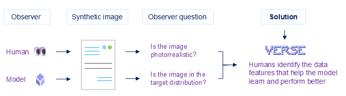
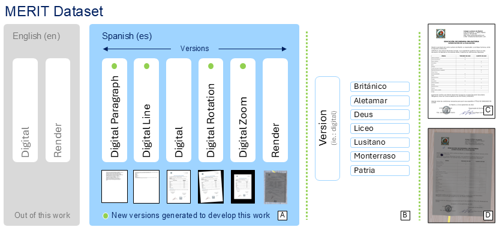
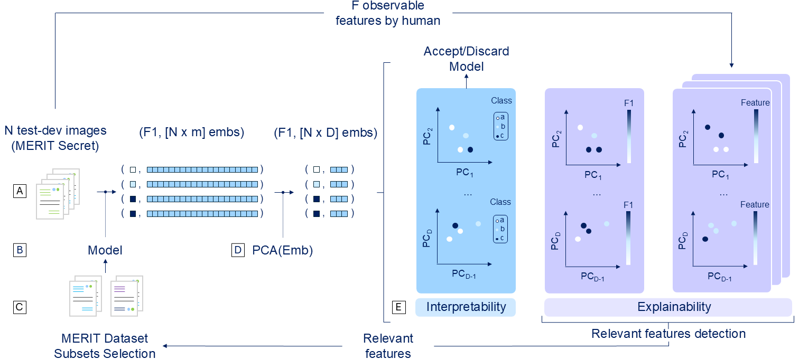
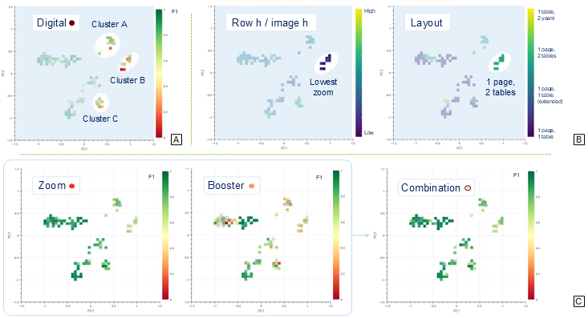

# VERSE 📄🔍👀
### Visual Embedding Reduction and Space Exploration — Clustering-guided Insights for Training Data Enhancement in V-rDu

<p align="center" style="margin-top: 50px; margin-bottom: 50px;">
  <br>
</p>


## Introduction :information_source:
Visually-rich Document Understanding (VrDU) consists of a model synthesizing or selecting information from documents (images with text) to answer questions, classify data or extract information. VrDU tasks are multimodal, i.e., models use text, images, or even the document layout to solve the tasks.

We usually train VLMs on visual synthetic data that we (as humans) label as photorrealistic. We argue that this is an anthropocentric perspective imposed to a model that might not synthetize visual information as we do. VERSE helps to visualize latent space and overlay visual features to detect poor-performance regions and take action to include better suited training sets to boost model performance.

<p align="center" style="margin-top: 50px; margin-bottom: 50px;">
  <br>
  <em> Figure 1. Traditionally, the quality of synthetic images in a dataset is assessed from an anthropocentric perspective, answering the question of whether such images appear photorealistic. In contrast, this work proposes evaluating the images from the model’s perspective through visual embedding analysis.
  </em>
</p>

## Models 👾
We use different Vision Language Models (VLMs) with varying visual signal strenght and diverse visual world models. We prove VERSE over those models showing and using stronger visual representations (Donut and Idefics2). 

| Model                         | Pre-Trained 🤗 version | Input data | Task |
|------------------------------|--------------|----------|----------|
| LayoutLMv2     | microsoft/layoutlmv2-base-uncased     | I + T + L| Token classification|
| LayoutXLM    | microsoft/layoutxlm-base        | I + T + L       |Token classification|
| LayoutLMv3    | microsoft/layoutlmv3-base        | I + T + L       |Token classification|
| Donut    | naver-clova-ix/donut-base        | I + T       |Sequence Generation|
| Idefics2    | HuggingFaceM4/idefics2-8b        | I + T       |Sequence Generation|
| PaliGemma    | google/paligemma-3b-pt-224       | I + T       |Sequence Generation|
| LLaVA    | LLaVA-hf/LLaVA-1.5-7b-hf       | I + T       |Sequence Generation|

<em> 
Table 1. Models pre-considered in this research.
</em>

## Datasets 📑

### Training Dataset 📄
We use the Spanish partition of the MERIT Dataset. The MERIT Dataset is a synthetic multimodal dataset (Image + Text + Layout) crafted for Visually-rich Document Understanding tasks. You can find more about MERIT Dataset here:

+ **Dataset:** [MERIT Dataset @ Hugging Face 🤗](https://huggingface.co/datasets/de-Rodrigo/merit)
+ **MERIT Dataset Paper:** [@ Pattern Recognition](https://www.sciencedirect.com/science/article/pii/S0031320325011653) and [@ ArXiv](https://arxiv.org/abs/2409.00447)
+ **Pipeline code:** [MERIT Dataset generation pipeline](https://github.com/nachoDRT/MERIT-Dataset)

<p align="center" style="margin-top: 50px; margin-bottom: 50px;">
  <br>
  <em>
    Figure 2. Training samples used. We employ the Spanish-language subsets of the MERIT Dataset, across its different versions (A). Each version comprises data from seven different schools (B). New versions complement the vanilla MERIT Dataset, composed of digital document samples (C) and their renderized versions (D).  More information available in the
    <a href="https://www.sciencedirect.com/science/article/pii/S0031320325011653">MERIT Dataset paper</a>.
  </em>
</p>

### Test-Dev Dataset 📜

We use MERIT Secret (a real dataset under Non-Disclosure Agreement) as test-dev dataset.

## Methodology 🔄

<p align="center" style="margin-top: 50px; margin-bottom: 50px;">
  <br>
  <em>
    Figure 3. VERSE methodology. More information available in the
    <a href="https://arxiv.org/">VERSE paper</a>.
  </em>
</p>


## Results 📈

<p align="center" style="margin-top: 50px; margin-bottom: 50px;">
  <br>
  <em>
    Figure 4. We detect conflictive clusters and the main features driving them so we can adjust our training data. In this example, we explore Idefics2 Reduced Embedding Space and boost its performance by combining resonating data that targets conflictive clusters.
</em>
</p>


| Model                         | Deployment | Fine-tuned | F1 |
|------------------------------|--------------|----------|----------|
| Idefics2     | On-premise     | VERSE | 0.8101|
| GPT4-O    | API fine-tune        | API fine-tune       |0.7821|
| Donut    | On-premise        | VERSE       |0.7607|
| Pixtral    | API-Based        | N/A      |0.7267|

<em> 
Table 2. Comparison of the best-performing models. After applying the VERSE methodology, on-premise models achieve performance comparable to API-based solutions.
</em>

<p align="center" style="margin-top: 50px; margin-bottom: 50px;">
  <br>
  <em>
    Figure 5. Synthetic training-samples moving across the Reduced Embedding Space (RES) of Donut. Every step shows the same sample under increasing level of visual information (purple). In background, PC maps showing F1 scores of the target (test-dev) samples.
</em>
</p>

## Resources 🧭
**Explore Reduced Embedding Spaces:** [VERSE Space @ Hugging Face 🤗](https://huggingface.co/spaces/de-Rodrigo/Embeddings)

## Team 🤜🤛

We are researchers from **[Comillas Pontifical University](https://www.iit.comillas.edu/)**
 - **Ignacio de Rodrigo [@nachoDRT](https://github.com/nachoDRT)**: PhD Student.
 - **Álvaro López [@allopez](https://www.iit.comillas.edu/personas/allopez)**: Supervisor.
 - **Jaime Boal [@jboal](https://github.com/jboalml)**: Supervisor.

## Citation 📃✒️
If you find our research interesting, please cite our works. :page_with_curl::black_nib:

**VERSE**
```bibtex
@article{WIP,
  title={WIP},
  author={WIP},
  journal={arXiv preprint arXiv:WIP},
  year={2025}
}
```

**MERIT Dataset**
```bibtex
@article{deRodrigo2025merit,
title = {The MERIT dataset: Modelling and efficiently rendering interpretable transcripts},
journal = {Pattern Recognition},
volume = {172},
pages = {112502},
year = {2026},
issn = {0031-3203},
doi = {https://doi.org/10.1016/j.patcog.2025.112502},
url = {https://www.sciencedirect.com/science/article/pii/S0031320325011653},
author = {Ignacio {de Rodrigo} and Alberto Sanchez-Cuadrado and Jaime Boal and Alvaro J. Lopez-Lopez},
```