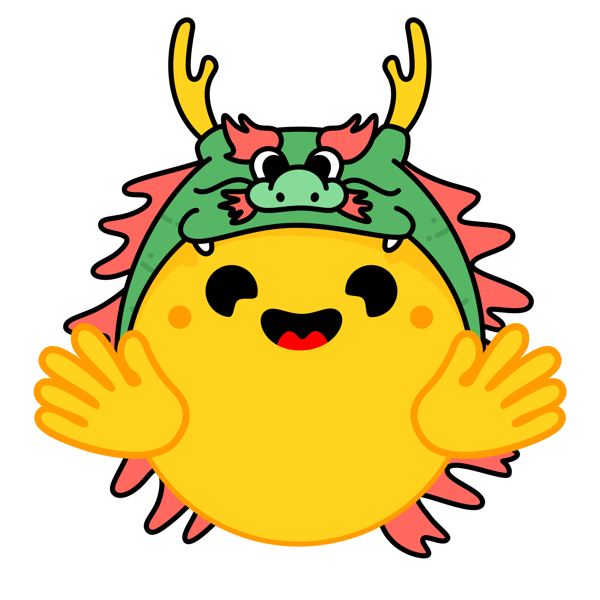

# DONUT Cord-v2

<a href="https://x.com/nearcyan/status/1706914605262684394">
  <div style="text-align: center;">
    <picture>
      <source media="(prefers-color-scheme: dark)" srcset="assets/dragon_huggingface.png">
      <source media="(prefers-color-scheme: light)" srcset="assets/dragon_huggingface.png">
      
    </picture>
  </div>
</a>


## Model Architecture
**This model is based on the Donut architecture and fine-tuned on the Cord-v2 dataset for form understanding tasks.**

- Backbone: [Donut](https://huggingface.co/models)
- Training Data: [Cord-v2](https://huggingface.co/datasets/naver-clova-ix/cord-v2)

## Example Usage

```python
from transformers import AutoProcessor, AutoModel

processor = AutoProcessor.from_pretrained("de-Rodrigo/donut-merit")
model = AutoModel.from_pretrained("de-Rodrigo/donut-merit")
```
**WIP** 🛠️